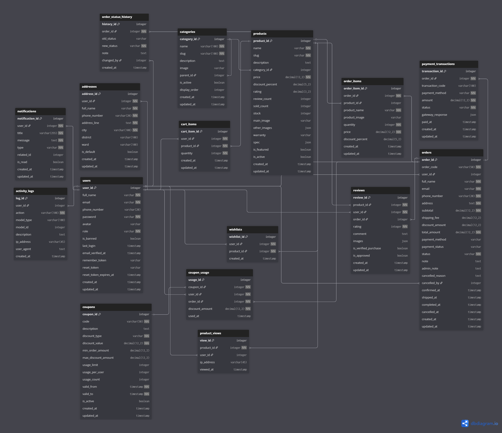
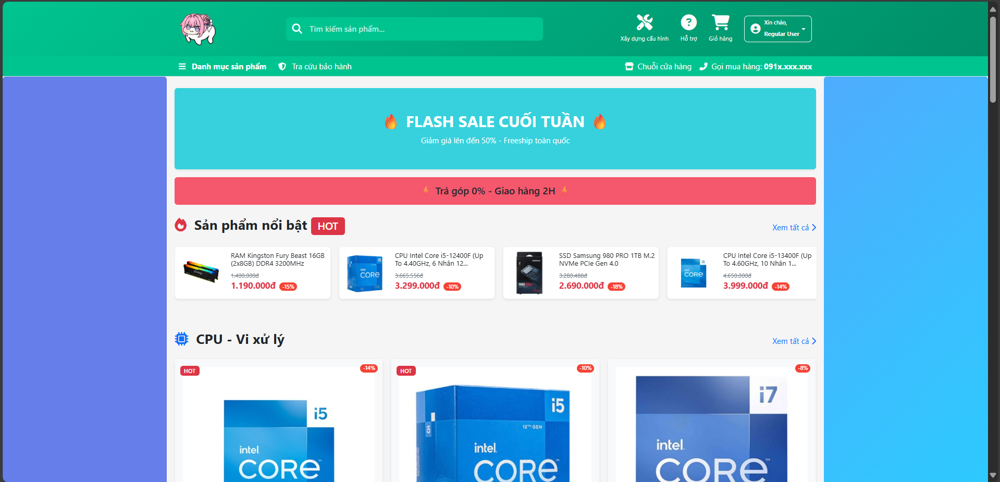
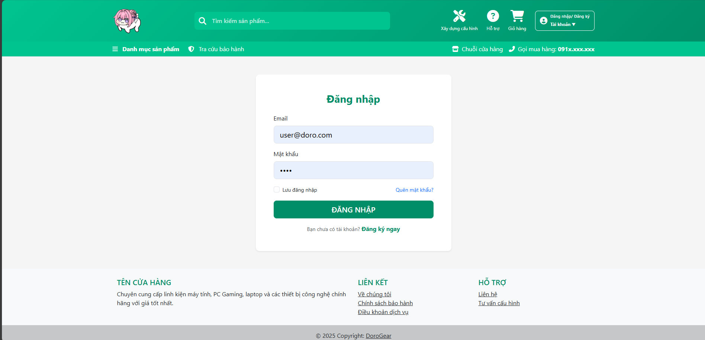
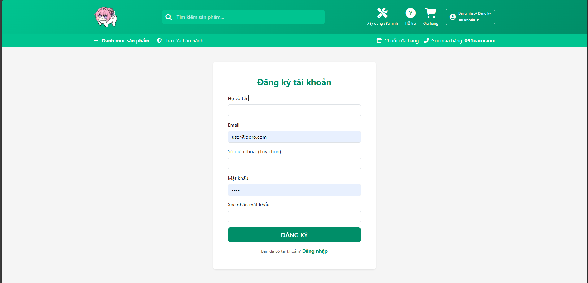
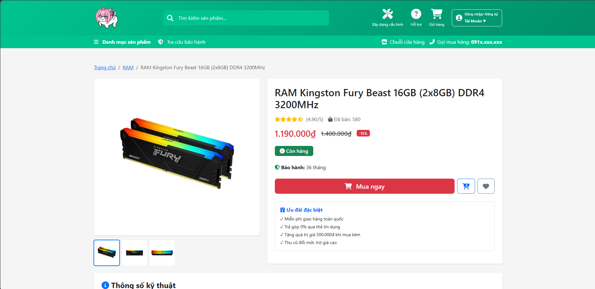
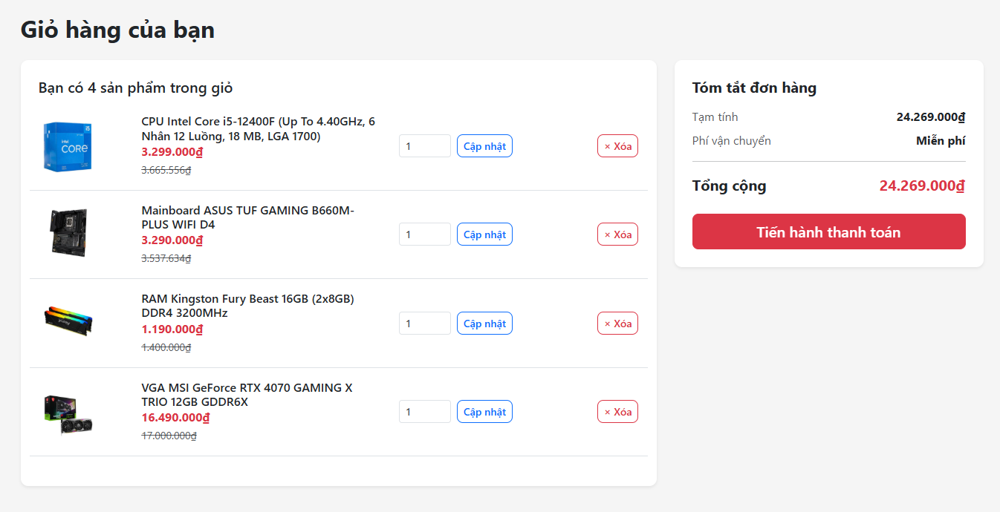
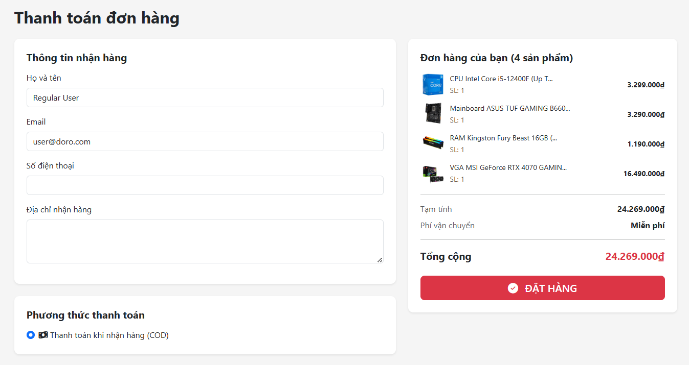

<p align="center">
  
</p>

<h1 align="center">Website Bán Linh Kiện Máy Tính</h1>

<div align="center">


</div>

<div align="center">


</div>

---
                        TRƯỜNG ĐẠI HỌC PHENIKAA KHOA CÔNG NGHỆ THÔNG TIN   
                                BÁO CÁO THỰC HÀNH MÔN WED NÂNG CAO
                            ĐỀ TÀI: XÂY DỰNG PHẦN MỀM BÁN HÀNG MÁY TÍNH
                            Giảng viên hướng dẫn: NGUYỄN THỊ THÙY LIÊN 
     


                                                            
                                                                               
## Thông tin nhóm

- Trần Bá Minh Đức - 23010210
- Vũ Thành Long - 23010882
- Bùi Quang Huy - 23010865

---

## 📖 Giới thiệu

<div align="center">

**DoroGearPHP** là website thương mại điện tử chuyên bán linh kiện máy tính, được phát triển với công nghệ hiện đại.

[](https://laravel.com)
[](https://vitejs.dev)
[](LICENSE)

</div>

### ✨ Điểm nổi bật
```
🚀 Hiệu suất cao          ⚡ Build nhanh với Vite
🎨 Giao diện hiện đại     🔒 Bảo mật tốt
📱 Responsive design      🛠️ Dễ bảo trì & mở rộng
```

---

## 💻 Yêu cầu hệ thống

<table>
<tr>
<td>

**Backend**
- 
- 

</td>
<td>

**Frontend**
- 
- 

</td>
<td>

**Database & Storage**
- 
- 

</td>
</tr>
</table>

---

## 🚀 Cài đặt và chạy dự án

### ▶ Bước 1: Clone repository
```bash
 git clone https://github.com/Phenikaa-team/DoroGearPHP.git
 cd DoroGearPHP
```

### ▶ Bước 2: Cài đặt dependencies

```bash
  # Cài đặt PHP dependencies
  composer install
  
  # Cài đặt Node dependencies
  npm install
```

### ▶ Bước 3: Cấu hình môi trường

**3.1. Tạo file môi trường**

```bash
  cp .env.example .env
  php artisan key:generate
```

**3.2. Cấu hình database & cloudinary**

Mở file `.env` và cập nhật:
```env
DB_CONNECTION=mysql
DB_HOST=127.0.0.1
DB_PORT=3306
DB_DATABASE=your_database_name
DB_USERNAME=your_username
DB_PASSWORD=your_password

CLOUDINARY_URL=cloudinary://your_cloudinary_url
```

> 💡 **Lưu ý:** Đăng ký tài khoản miễn phí tại [Cloudinary](https://cloudinary.com/) để lấy `CLOUDINARY_URL`

### ▶ Bước 4: Khởi tạo cơ sở dữ liệu

```bash
  # Chạy migration và seed dữ liệu mẫu
  php artisan migrate:fresh --seed
```

> ⚠️ Lệnh này sẽ xóa toàn bộ dữ liệu cũ và tạo mới

### ▶ Bước 5: Khởi chạy dự án

Mở **2 terminal** và chạy đồng thời:

<table>
<tr>
<td width="50%">

**Terminal 1️⃣ – Frontend (Vite)**
```bash
  npm run dev
```


</td>
<td width="50%">

**Terminal 2️⃣ – Backend (Laravel)**
```bash
  php artisan serve
```


</td>
</tr>
</table>

### 🎉 Hoàn tất!

Truy cập website tại: **[http://127.0.0.1:8000](http://127.0.0.1:8000)**

---

## 📐 Kiến trúc & Database

### 🗂️ Database Schema (ERD)

<div align="center">



*Sơ đồ quan hệ cơ sở dữ liệu đầy đủ của hệ thống*

[](public/images/uml.png)

</div>

---

### 📊 Mô tả các bảng chính

<table>
<tr>
<td width="33%">

#### 👤 **Users & Authentication**
- **users** - Thông tin người dùng
- **addresses** - Địa chỉ giao hàng
- **notifications** - Thông báo hệ thống

</td>
<td width="33%">

#### 📦 **Products & Categories**
- **products** - Sản phẩm
- **categories** - Danh mục
- **reviews** - Đánh giá sản phẩm
- **wishlists** - Yêu thích

</td>
<td width="33%">

#### 🛒 **Orders & Cart**
- **orders** - Đơn hàng
- **order_items** - Chi tiết đơn
- **cart_items** - Giỏ hàng
- **coupons** - Mã giảm giá

</td>
</tr>
</table>

---

### 🏗️ Kiến trúc hệ thống (MVC Pattern)
```
┌─────────────────────────────────────────────────────────────┐
│                     CLIENT LAYER                            │
│              Browser / Mobile Device                        │
└──────────────────────────┬──────────────────────────────────┘
                           │ HTTP/HTTPS Request
                           ▼
┌─────────────────────────────────────────────────────────────┐
│                    PRESENTATION LAYER                       │
│   ┌─────────────────────────────────────────────────────┐   │
│   │  Frontend (Vite + Sass + Bootstrap + Tailwind)      │   │
│   │  • Blade Templates                                  │   │
│   │  • JavaScript ES6+                                  │   │
│   │  • Responsive UI Components                         │   │
│   └─────────────────────────────────────────────────────┘   │
└──────────────────────────┬──────────────────────────────────┘
                           │
                           ▼
┌─────────────────────────────────────────────────────────────┐
│                   APPLICATION LAYER                         │
│                    Laravel 11 (MVC)                         │
│   ┌────────────┬─────────────┬──────────────┬────────────┐  │
│   │ Routes     │ Controllers │  Middleware  │  Services  │  │
│   │ (web.php)  │             │              │            │  │
│   └────────────┴─────────────┴──────────────┴────────────┘  │
│   ┌────────────┬─────────────┬──────────────┬────────────┐  │
│   │ Models     │ Validation  │  Events      │  Jobs      │  │
│   │ (Eloquent) │ (Requests)  │              │  (Queue)   │  │
│   └────────────┴─────────────┴──────────────┴────────────┘  │
└──────────────────────────┬──────────────────────────────────┘
                           │
                           ▼
┌─────────────────────────────────────────────────────────────┐
│                      DATA LAYER                             │
│   ┌──────────────────┐            ┌──────────────────┐      │
│   │  MySQL Database  │            │    Cloudinary    │      │
│   │  • 12 Tables     │            │  • Images/Media  │      │
│   │  • Relationships │            │  • CDN Storage   │      │
│   └──────────────────┘            └──────────────────┘      │
└─────────────────────────────────────────────────────────────┘
```

---

## 💻 Giao diện của trang

<table>
<tr>
<td width="50%">

### 🏠 Trang chủ
Hiển thị banner, sản phẩm nổi bật và danh mục


</td>
<td width="50%">

### 🔐 Đăng nhập
Form đăng nhập với validation


</td>
</tr>
<tr>
<td width="50%">

### 📝 Đăng ký
Đăng ký tài khoản mới


</td>
<td width="50%">

### 📦 Chi tiết sản phẩm
Thông tin đầy đủ về sản phẩm


</td>
</tr>
<tr>
<td width="50%">

### 🛒 Giỏ hàng
Quản lý sản phẩm trong giỏ


</td>
<td width="50%">

### 💳 Thanh toán
Xác nhận và hoàn tất đơn hàng


</td>
</tr>
</table>
</div>

---

## ⚙️ Các chức năng của trang

### 
- [x] Đăng ký tài khoản
- [x] Đăng nhập/Đăng xuất
- [x] Quản lý thông tin cá nhân
- [x] Đổi mật khẩu
- [ ] Quên mật khẩu và khôi phục
- [x] Phân quyền người dùng (Admin, User)

### 
- [x] Hiển thị danh sách sản phẩm
- [x] Tìm kiếm sản phẩm
- [x] Lọc sản phẩm theo danh mục
- [x] Xem chi tiết sản phẩm
- [ ] Đánh giá và bình luận sản phẩm
- [x] Sản phẩm liên quan
- [x] Sản phẩm nổi bật

### 
- [x] Thêm sản phẩm vào giỏ hàng
- [x] Cập nhật số lượng sản phẩm trong giỏ
- [x] Xóa sản phẩm khỏi giỏ hàng
- [ ] Áp dụng mã giảm giá
- [x] Đặt hàng và thanh toán
- [ ] Xem lịch sử đơn hàng
- [ ] Theo dõi trạng thái đơn hàng

### 
- [x] Thanh toán COD (Tiền mặt khi nhận hàng)
- [ ] Thanh toán online qua cổng thanh toán
- [x] Tính phí vận chuyển
- [ ] Xuất hóa đơn

### -F44336?style=flat-square)
- [ ] Dashboard thống kê
- [ ] Quản lý sản phẩm (CRUD)
- [ ] Quản lý danh mục sản phẩm
- [ ] Quản lý đơn hàng
- [ ] Quản lý người dùng
- [ ] Quản lý mã giảm giá
- [ ] Quản lý bình luận/đánh giá
- [ ] Quản lý banner/slider
- [ ] Báo cáo doanh thu
